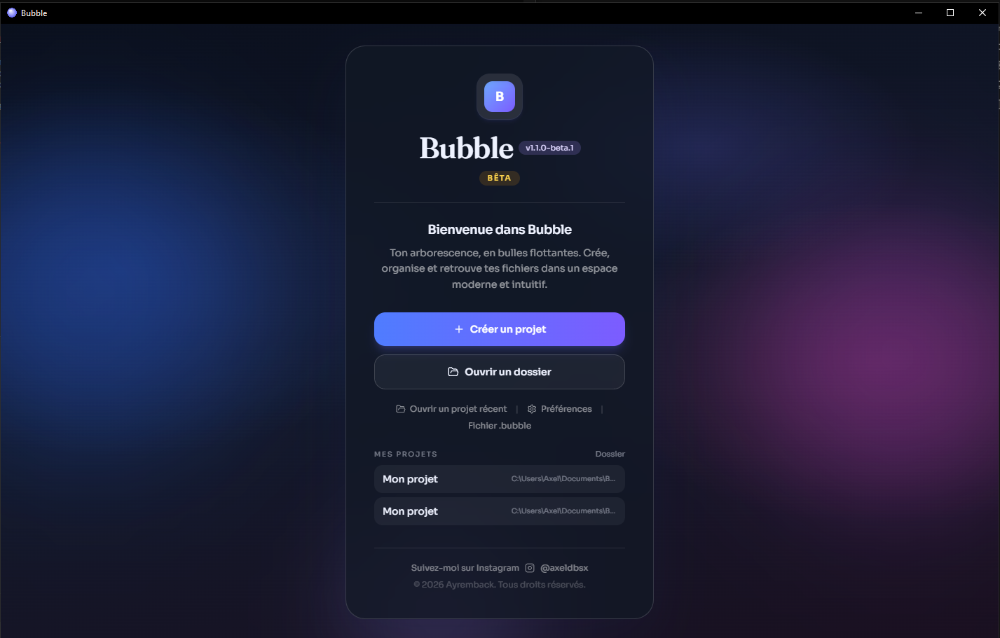
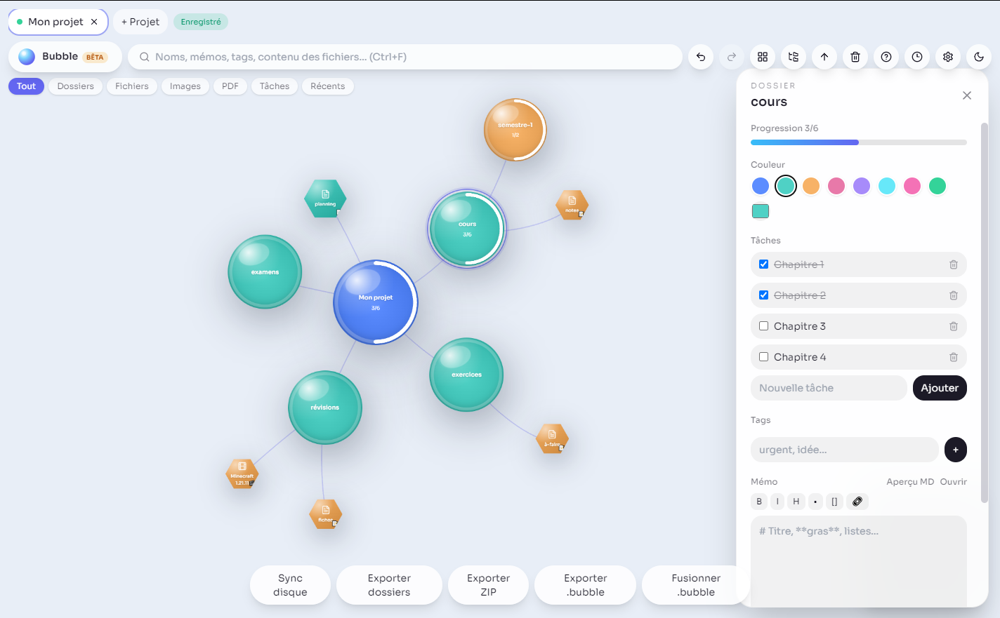
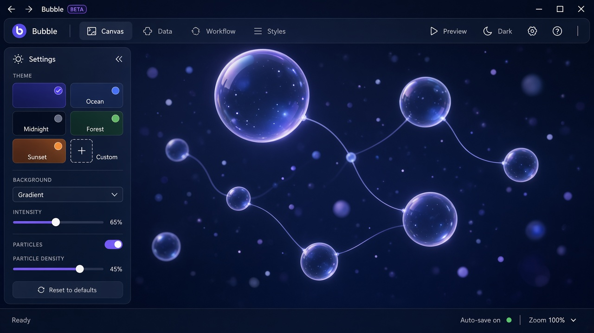

# Bubble

**Accès anticipé · Bêta** — gestionnaire de fichiers Windows en bulles flottantes.

Bubble transforme ton arborescence en un espace 2D : dossiers et fichiers deviennent des bulles interconnectées, faciles à déplacer, organiser et retrouver.

  

## Aperçu

| Jour | Nuit |
| :---: | :---: |
|  |  |

## Fonctionnalités

- **Canvas infini** — zoom, pan, bulles flottantes et liens souples
- **Projets bibliothèque** — créés dans `Documents/Bubble` pour ne plus les perdre
- **Templates** — Dev, Design, Cours… et modèles perso
- **Tâches & progression** — anneaux sur les dossiers
- **Recherche** — noms, tags, mémos **et contenu** des fichiers texte
- **Corbeille Bubble** — suppression récupérable
- **Thèmes** — Aurore, Papier, Océan, Braise, Minuit + mode nuit
- **Mises à jour auto** — via GitHub Releases (installateur NSIS)
- **Didacticiel** intégré + aide raccourcis (`F1`)

## Télécharger (bêta)

Installeurs Windows : **[Releases](https://github.com/Ayremback/bubble-app/releases)**

> Prends le fichier **`Bubble-Setup-….exe`** (installateur), pas le portable — c’est lui qui reçoit les mises à jour.

Windows peut afficher un avertissement SmartScreen (pas encore de certificat de signature) :  
**Informations complémentaires → Exécuter quand même**.

## Pour les bêta-testeurs

1. Installe la dernière Release  
2. Explore, casse des choses, note les bugs  
3. Feedback bienvenu — Instagram [@axeldbsx](https://www.instagram.com/axeldbsx)

Version actuelle : voir le badge Release (ex. `1.1.0-beta.1`).

## Raccourcis utiles

| Raccourci | Action |
| --- | --- |
| `Ctrl + F` | Recherche |
| `Ctrl + L` | Réorganiser les bulles |
| `Ctrl + T` | Arborescence |
| `Ctrl + Z / Y` | Annuler / rétablir |
| `F2` | Renommer |
| `Suppr` | Corbeille |
| `F1` | Aide |

Stack : Electron · React · TypeScript · Vite · Zustand · Framer Motion · Tailwind

## Crédits

Créé par **Ayremback** · Instagram [@axeldbsx](https://www.instagram.com/axeldbsx)

---

*Bubble est en accès anticipé. La version finale arrivera après les retours des testeurs.*
